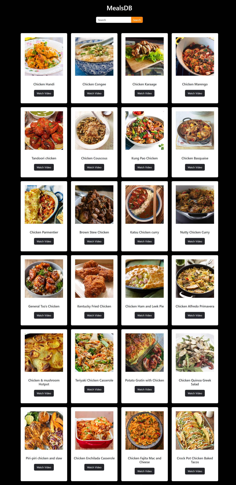

<!-- @format -->

# Meal Finder Website

## Description

The Meal Finder website is a project developed during a hackathon. It's designed to help users easily find and learn how to cook various meals. Whether you're a beginner or an experienced chef, this website provides a wide range of recipes and cooking instructions.

## Features

Search for recipes by name.
Get detailed instructions for cooking each meal.

Watch cooking videos for selected recipes.

Enjoy a responsive and user-friendly design.

## Screenshots

## Usage

Enter the name of a meal you want to cook in the search bar.
Click the "Search" button.

Browse through the search results to find your desired recipe.

Click on a recipe card to view detailed instructions and watch a cooking video.

## API Used

The Meal Finder website utilizes the MealDB API:(https://www.themealdb.com/api/json/v1/1/search.php?s=chicken) to fetch and display recipes.

## Contributing

If you'd like to contribute to this project, please follow these steps:

Fork the repository: (https://github.com/Godson2611/Meal-Finder.git).

Create a new branch for your feature: git checkout -b feature-name.

Make your changes and commit them: git commit -m 'Add some feature'.

Push your changes to the branch: git push origin feature-name.
Create a pull request.
